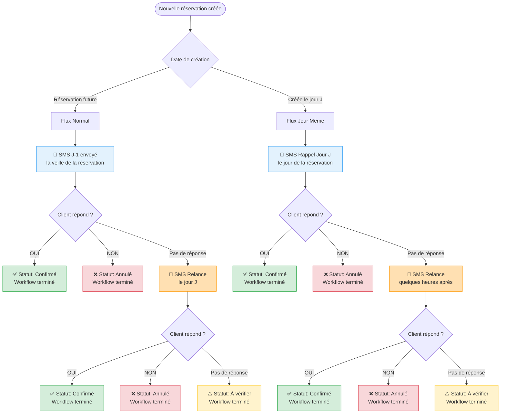

# OuiClient - Gestion des Réservations par SMS

## 📊 Statuts des Réservations

Chaque réservation passe par différents statuts pour suivre son parcours depuis la création jusqu'à la confirmation ou l'annulation. Voici ce que signifie chaque statut :

### 🟦 À envoyer
**Ce que ça veut dire :** La réservation a été créée (manuellement ou importée depuis un CSV) mais le SMS de confirmation n'a pas encore été envoyé au client.

**Ce qu'il faut faire :** Sélectionner ces réservations et cliquer sur "Envoyer les SMS" pour envoyer les messages de confirmation.

**Badge :** Gris avec texte "À envoyer"

---

### 🔵 SMS envoyé
**Ce que ça veut dire :** Le SMS a été envoyé vers le téléphone du client, mais on n'a pas encore de confirmation qu'il a bien été reçu.

**Ce qu'il faut faire :** Attendre la confirmation de livraison (quelques secondes à quelques minutes).

**Badge :** Bleu avec texte "SMS envoyé"

---

### 🟣 SMS reçu
**Ce que ça veut dire :** L'opérateur téléphonique nous a confirmé que le SMS a bien été livré sur le téléphone du client. Le client peut maintenant le lire et y répondre.

**Ce qu'il faut faire :** Attendre que le client réponde OUI ou NON au SMS.

**Badge :** Indigo avec texte "SMS reçu"

---

### 🟢 Confirmée
**Ce que ça veut dire :** Le client a répondu "OUI" au SMS. La réservation est confirmée !

**Ce qu'il faut faire :** Rien, tout est bon. Le client viendra au restaurant.

**Badge :** Vert avec texte "Confirmée"

---

### 🔴 Annulée
**Ce que ça veut dire :** Le client a répondu "NON" au SMS. La réservation est annulée.

**Ce qu'il faut faire :** Libérer la table pour d'autres clients. Vous pouvez supprimer cette réservation du système.

**Badge :** Rouge avec texte "Annulée"

---

### 🟡 À vérifier
**Ce que ça veut dire :** Le client a répondu au SMS mais sa réponse n'est pas claire (ni "OUI" ni "NON"). Par exemple : "Peut-être", "Je ne sais pas encore", etc.

**Ce qu'il faut faire :** Appeler le client pour clarifier sa réponse et mettre à jour manuellement le statut.

**Badge :** Jaune avec texte "À vérifier"

---

### 🔴 Échec
**Ce que ça veut dire :** Le SMS n'a pas pu être envoyé ou livré. Cela peut arriver si :
- Le numéro de téléphone est invalide
- Le téléphone est éteint ou hors réseau pendant trop longtemps
- Le numéro est sur liste noire

**Ce qu'il faut faire :** Vérifier le numéro de téléphone et appeler directement le client pour confirmer la réservation.

**Badge :** Rouge foncé avec texte "Échec"

---

## 📈 Tableau de Bord

Le tableau de bord affiche 8 cartes avec le nombre de réservations dans chaque statut :

| Carte | Description |
|-------|-------------|
| **Total** | Nombre total de réservations pour la date sélectionnée |
| **À envoyer** | Réservations en attente d'envoi de SMS |
| **SMS envoyés** | SMS envoyés mais pas encore livrés |
| **SMS reçus** | SMS confirmés comme livrés par l'opérateur |
| **Confirmées** | Clients qui ont répondu OUI |
| **Annulées** | Clients qui ont répondu NON |
| **À vérifier** | Réponses ambiguës nécessitant un appel |
| **Échec** | Envois échoués nécessitant une action |

---

## 🔄 Cycle de Vie d'une Réservation

```
1. À envoyer (création)
   ↓
2. SMS envoyé (envoi du message)
   ↓
3. SMS reçu (confirmation de livraison)
   ↓
4a. Confirmée (client répond OUI) ✅
   OU
4b. Annulée (client répond NON) ❌
   OU
4c. À vérifier (réponse ambiguë) ⚠️

Note : À tout moment, le statut peut devenir "Échec" si l'envoi échoue
```

---

## 📱 Workflow SMS - Flux de Confirmation

Le système SMS suit **deux parcours différents** selon le moment de création de la réservation :

### 📊 Diagramme du Flux



### 🔄 Les Deux Parcours Expliqués

#### 1️⃣ Parcours Normal (Réservations Futures)

**Exemple** : Réservation créée le lundi pour jeudi soir

| Étape | Moment | Message | Action suivante |
|-------|--------|---------|-----------------|
| **1. SMS J-1** | Mercredi (veille) | "Votre réservation demain..." | Attendre réponse |
| **2. Relance** | Jeudi (jour J) | "Rappel: votre réservation ce soir..." | Attendre réponse |
| **3. Terminé** | - | - | Statut final: Confirmé/Annulé/À vérifier |

**Pourquoi pas de "Rappel Jour J" ?**
- Le client a déjà reçu un SMS la veille
- Le "Rappel Jour J" serait redondant
- On passe directement à la Relance si pas de réponse

#### 2️⃣ Parcours Jour Même (Réservations Créées le Jour J)

**Exemple** : Réservation créée le jeudi à 14h pour jeudi soir

| Étape | Moment | Message | Action suivante |
|-------|--------|---------|-----------------|
| **1. Rappel Jour J** | Jeudi après-midi | "Votre réservation ce soir..." | Attendre réponse |
| **2. Relance** | Jeudi fin d'après-midi | "Rappel: votre réservation ce soir..." | Attendre réponse |
| **3. Terminé** | - | - | Statut final: Confirmé/Annulé/À vérifier |

**Pourquoi "Rappel Jour J" ici ?**
- Impossible d'envoyer un J-1 (réservation créée le jour même)
- Le "Rappel Jour J" remplace le J-1
- Ensuite, même logique : Relance si pas de réponse

### 📌 Points Clés

1. **Deux flux distincts** basés sur la date de création
2. **Pas de "Rappel Jour J" après un J-1** (redondant)
3. **"Rappel Jour J" uniquement** pour les réservations créées le jour même
4. **Relance = dernière chance** avant statut "À vérifier"
5. **Workflow s'arrête** dès que le client répond ou après la Relance

---

## 💡 Conseils

- **Envoyez les SMS groupés** : Sélectionnez plusieurs réservations "À envoyer" et envoyez-les en une seule fois
- **Surveillez les "À vérifier"** : Traitez-les rapidement pour éviter les no-shows
- **Vérifiez les "Échec"** : Ces clients n'ont pas reçu le SMS, appelez-les pour confirmer
- **Export quotidien** : Utilisez la fonction récapitulatif email pour avoir un suivi par email
