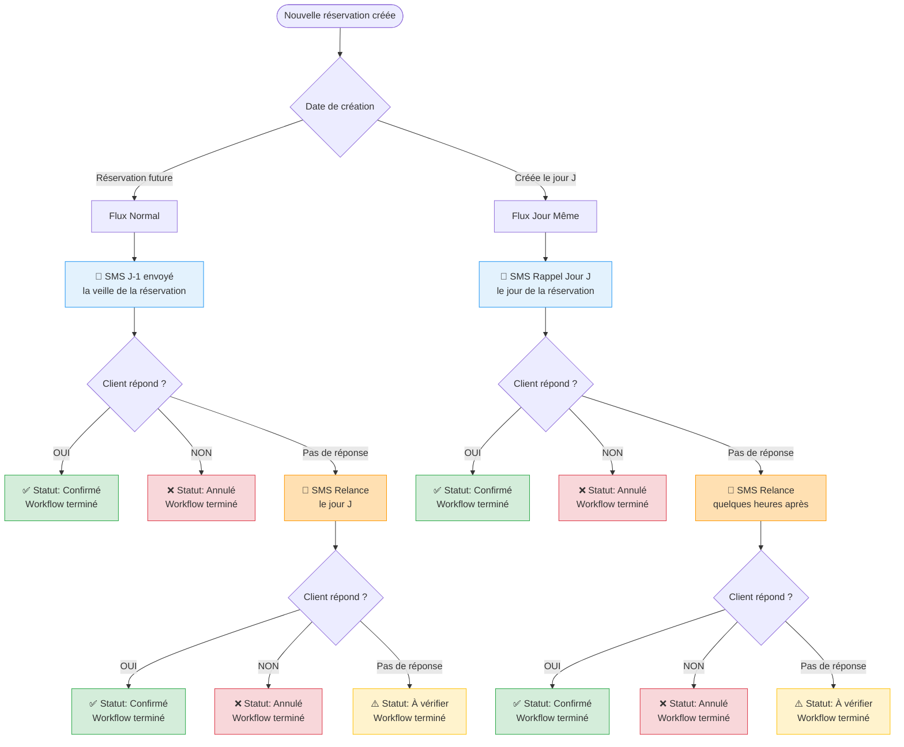
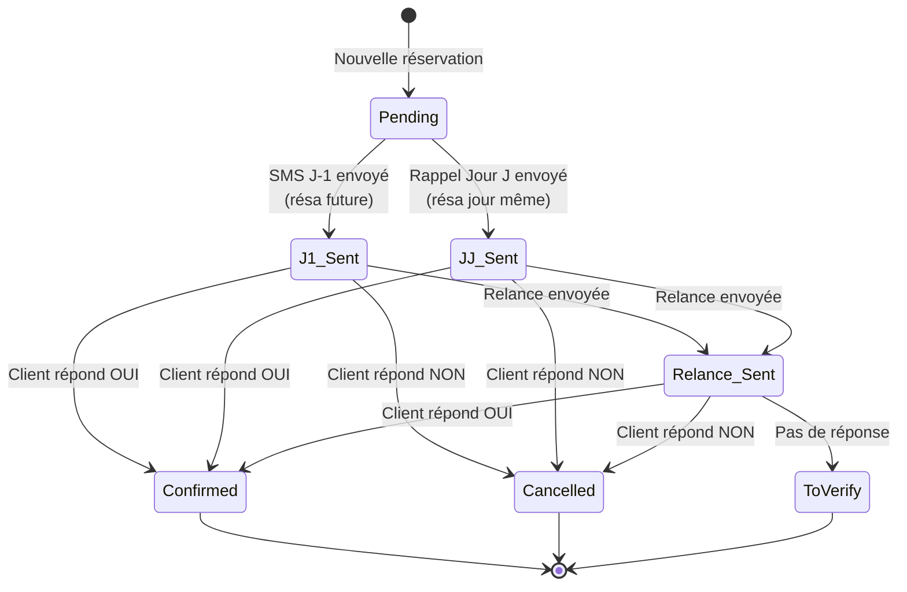

# Workflow SMS - Flux de confirmation des réservations

## Vue d'ensemble

Le système SMS suit deux parcours différents selon le **moment de création** de la réservation :

1. **Réservations futures** (créées à l'avance) : J-1 → Relance
2. **Réservations jour même** (créées le jour J) : Rappel Jour J → Relance

---

## 📊 Diagramme du flux



---

## 🔄 Les deux parcours expliqués

### 1️⃣ Parcours Normal (Réservations futures)

**Exemple** : Réservation créée le lundi pour jeudi soir

| Étape | Moment | Message | Action suivante |
|-------|--------|---------|-----------------|
| **1. SMS J-1** | Mercredi (veille) | "Votre réservation demain..." | Attendre réponse |
| **2. Relance** | Jeudi (jour J) | "Rappel: votre réservation ce soir..." | Attendre réponse |
| **3. Terminé** | - | - | Statut final: Confirmé/Annulé/À vérifier |

**Pourquoi pas de "Rappel Jour J" ?**
- Le client a déjà reçu un SMS la veille
- Le "Rappel Jour J" serait redondant
- On passe directement à la Relance si pas de réponse

---

### 2️⃣ Parcours Jour Même (Réservations créées le jour J)

**Exemple** : Réservation créée le jeudi à 14h pour jeudi soir

| Étape | Moment | Message | Action suivante |
|-------|--------|---------|-----------------|
| **1. Rappel Jour J** | Jeudi après-midi | "Votre réservation ce soir..." | Attendre réponse |
| **2. Relance** | Jeudi fin d'après-midi | "Rappel: votre réservation ce soir..." | Attendre réponse |
| **3. Terminé** | - | - | Statut final: Confirmé/Annulé/À vérifier |

**Pourquoi "Rappel Jour J" ici ?**
- Impossible d'envoyer un J-1 (réservation créée le jour même)
- Le "Rappel Jour J" remplace le J-1
- Ensuite, même logique : Relance si pas de réponse

---

## 🎯 Règles de progression

### États terminaux (workflow arrêté)
- ✅ **Confirmé** : Client a répondu "OUI"
- ❌ **Annulé** : Client a répondu "NON"
- ⚠️ **À vérifier** : Aucune réponse après Relance

### Transitions automatiques



---

## 🔍 Changement technique (avant/après)

### ❌ Ancien comportement (incorrect)

**Réservation future** :
```
J-1 → Rappel Jour J (désactivé) → Relance
```
- Le bouton "Rappel Jour J" apparaissait mais était désactivé
- Message confus pour l'utilisateur : "Disponible le jour de la réservation"
- Étape inutile dans le workflow

### ✅ Nouveau comportement (correct)

**Réservation future** :
```
J-1 → Relance
```
- Saute directement à la Relance
- Workflow plus clair et logique
- Moins de confusion pour l'équipe

---

## 💻 Implémentation technique

### Base de données (colonnes utilisées)

| Colonne | Usage | Valeur |
|---------|-------|--------|
| `sms_sent_at` | Timestamp du SMS J-1 | `null` ou ISO timestamp |
| `reminder_sent_at` | Timestamp du Rappel Jour J | `null` ou ISO timestamp |
| `relance_sent_at` | Timestamp de la Relance | `null` ou ISO timestamp |
| `status` | État de la réservation | `pending` / `confirmed` / `cancelled` / `to_verify` |

### Logique de décision (`getNextSmsAction`)

```typescript
// Ordre de vérification :
1. Si status = confirmed/cancelled/to_verify → workflow terminé
2. Si relance_sent_at existe → workflow terminé
3. Si reminder_sent_at existe → prochaine action = Relance
4. Si sms_sent_at existe → prochaine action = Relance ✨ NOUVEAU
5. Si aucun SMS envoyé :
   - Si booking_date = aujourd'hui → Rappel Jour J
   - Sinon → J-1
```

---

## 📌 Points clés à retenir

1. **Deux flux distincts** basés sur la date de création
2. **Pas de "Rappel Jour J" après un J-1** (redondant)
3. **"Rappel Jour J" uniquement** pour les réservations créées le jour même
4. **Relance = dernière chance** avant statut "À vérifier"
5. **Workflow s'arrête** dès que le client répond ou après la Relance

---

## 🧪 Tests couverts

✅ 15 tests unitaires validant :
- États terminaux (confirmed, cancelled, to_verify)
- Workflow réservations futures (J-1 → Relance)
- Workflow réservations jour même (Jour J → Relance)
- Edge cases (réservations lointaines, transitions de dates)

---

**Date de mise à jour** : 2026-03-16
**Fichier source** : `src/lib/utils/sms-flow.ts`
**Tests** : `tests/unit/sms-flow.test.ts`
